# Slot Game Reel Optimization with GA and NSGA-II

## 1. What this project is about

This project uses Genetic Algorithms to search for a good reel configuration for a
3×3 slot game. For every candidate, I enumerate every possible stop combination, so
the RTP, win rate, Jackpot probability, and symbol distribution are exact rather than
estimated from random simulations. The original assignment is available in
[DS-HomeWork.md](./DS-HomeWork.md).

The original task mainly focuses on RTP and win rate, but I also wanted to look at the
game from a player-experience point of view. If a reel contains too many copies of the
same symbol, the screen can feel repetitive or unnatural. I therefore added symbol
concentration as another objective and tried to make the reel distribution more
balanced.

I also think a slot game should at least have a chance of producing a Jackpot. In this
project, a Jackpot means that all nine cells show the same symbol. The optimization
checks whether a candidate has any possible Jackpot result, while the actual Jackpot
probability is reported separately for analysis.

The game setup is:

- Three circular reels, each with 12 positions.
- Five symbols with multipliers of `0.25, 0.55, 1, 3, 5`.
- Five winning patterns defined by the assignment.
- Pattern 4.5, where all nine cells match, is treated as the Jackpot.
- Target RTP: 95%, with an acceptable range of 94%–96%.
- Minimum win rate: 55%.

With three 12-position reels, each candidate has `12³ = 1,728` possible stop
combinations. All of them are evaluated.

## 2. What I measure

### RTP and win rate

```python
rtp = total_payout / total_bet
win_rate = winning_spins / total_spins
```

### Reel symbol concentration

I use HHI to measure the symbol distribution of each reel, then average the three reel
values:

```python
reel_hhi = sum((symbol_count / reel_length) ** 2)
symbol_concentration = mean(reel_hhi for reel in reels)
```

A lower value means the symbols are more evenly distributed. With 12 positions and
five symbols, the most balanced count is `3, 3, 2, 2, 2`, which gives a theoretical
minimum concentration of `0.208333`.

### Jackpot

A stop combination is counted as a Jackpot when all nine cells contain the same
symbol:

```python
missing_jackpot = int(jackpot_spins == 0)
jackpot_probability = jackpot_spins / total_spins
```

`missing_jackpot` is used by the optimization. `jackpot_probability` is only reported
to show how often the Jackpot appears; the algorithm does not simply try to make this
probability as large as possible.

### Prize distribution

The result charts also group winning payouts into three simple tiers:

- Small: `≤ 1x bet`
- Medium: `> 1x and < 5x bet`
- Big: `≥ 5x bet`

Prize distribution is currently used for analysis, not as an optimization objective.

## 3. Methods and experiment setup

### 3.1 Shared settings

| Parameter | Value |
|---|---:|
| Population size | 200 |
| Generations | 1,000 |
| Reel length | 12 |
| Random seed | 42 |
| Single-symbol mutation rate | 4% |
| Adjacent-pair mutation rate | 25% |
| Swap mutation rate | 15% |

Because every candidate is fully enumerated, evaluating the same reels always produces
the same metrics and does not introduce sampling noise.

### 3.2 Baseline GA

The Baseline GA only considers the RTP and win-rate requirements from the original
assignment:

```python
fitness = rtp_error + 5 * win_rate_shortfall
```

It stops when RTP is between 94% and 96% and win rate is at least 55%.

### 3.3 Weighted GA

The Weighted GA combines four penalties into one score:

```python
objectives = (
    100 * rtp_violation,
    100 * win_rate_shortfall,
    30 * concentration_penalty,
    missing_jackpot,
)

fitness = sum(objectives)
```

The concentration penalty is normalized using its theoretical minimum before applying
the weight of 30. The Jackpot term only penalizes candidates with no possible Jackpot;
it does not reward endlessly increasing Jackpot probability.

The initial population contains 50% balanced reels and 50% random reels. A Jackpot
repair operator is also applied with a 10% probability.

### 3.4 NSGA-II

NSGA-II uses the same four objectives as the Weighted GA, but it keeps them separate.
Pareto dominance, non-dominated sorting, and crowding distance allow it to preserve
multiple trade-off solutions instead of returning only one weighted answer.

The NSGA-II search itself does not use hard constraints. After generating the Pareto
front, I first keep solutions that satisfy:

```python
0.90 <= rtp <= 1.00
win_rate > 0.45
jackpot_probability > 0
```

Among these candidates, solution 95 has the lowest symbol concentration, so I use it
for the final NSGA-II report and charts. This is a post-search selection rule and does
not restrict the search space during evolution.

### 3.5 GA operators and custom design choices

All three algorithms use single-point crossover on each reel and three mutation
operators:

- **Single-symbol mutation:** replaces one position with another symbol. This changes
  both the symbol count and the game metrics.
- **Adjacent-pair mutation:** changes two neighboring positions on a circular reel to
  the same symbol, making consecutive matching symbols more likely.
- **Swap mutation:** swaps two positions on the same reel. This is especially useful
  here because it changes the arrangement, RTP, win rate, and winning combinations
  without changing the symbol counts or concentration.

The Baseline and Weighted GAs keep the top five individuals through elitism. If there
is no improvement for 20 generations, they temporarily increase the mutation rates,
run a single-position local search around the best candidate, and replace 25% of the
population with random immigrants. These steps help the search move away from a local
optimum.

The Weighted GA and NSGA-II also use two game-specific ideas. First, half of the
initial population is deliberately balanced, while the other half remains random for
diversity. Second, Jackpot repair finds the smallest number of symbol replacements
needed to create a shared three-symbol window across the reels, making a nine-cell
Jackpot possible.

NSGA-II uses the same mutation and repair operators, but selection is based on Pareto
rank, crowding distance, and binary tournaments. The next generation is selected from
the combined parent and offspring populations.

## 4. Results

| Algorithm | Generation | RTP | Win rate | Concentration | Jackpot probability | Score |
|---|---:|---:|---:|---:|---:|---:|
| Baseline GA | 57 | 94.5833% | 55.9028% | 0.458333 | 0% | 0.004167 |
| Weighted GA | 1,000 | 95.1736% | 56.7130% | 0.393519 | 3.472222% | 7.017544 |
| NSGA-II solution 95 | 1,000 | 91.6667% | 46.8750% | 0.351852 | 1.388889% | 15.896930 |

The Baseline uses a different fitness function, so its score should not be compared
directly with the other two. The Weighted GA score is the sum of its four penalties.
NSGA-II does not minimize this sum during evolution; its displayed score is only a
convenient way to compare Pareto solutions.

### 4.1 Baseline GA

The Baseline reaches the original RTP and win-rate targets quickly, but it has no
possible Jackpot and has the highest concentration of the three selected results.

<details>
<summary>Show Baseline reels and charts</summary>

```text
Reel 1: [1, 1, 3, 1, 1, 1, 1, 3, 3, 3, 3, 1]
Reel 2: [3, 3, 1, 1, 1, 1, 1, 1, 1, 1, 3, 3]
Reel 3: [0, 2, 2, 1, 1, 3, 3, 2, 3, 3, 1, 3]
```

| Convergence | Metrics |
|---|---|
| 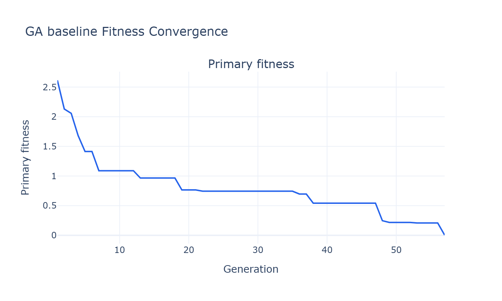 | 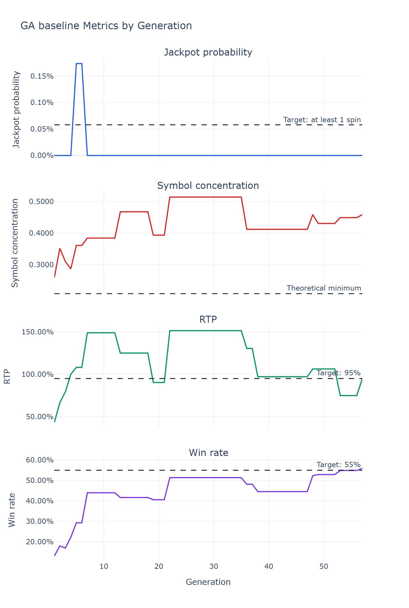 |
| Prize distribution | Reel symbol distribution |
| 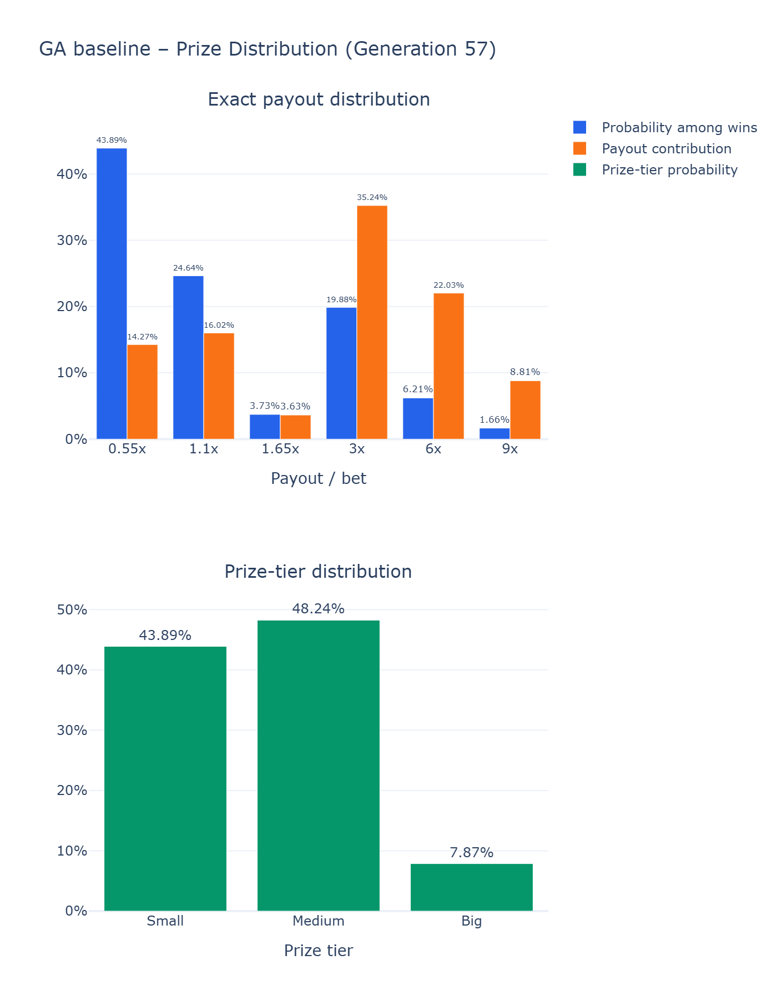 | 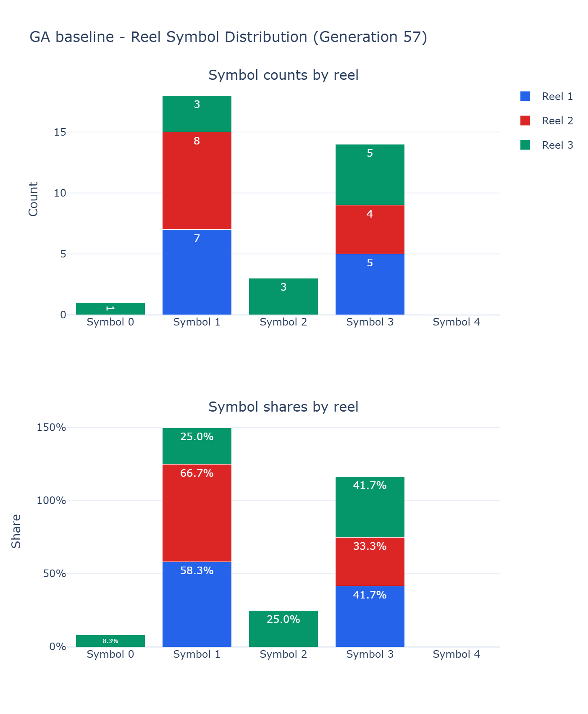 |

</details>

### 4.2 Weighted GA

The Weighted GA is the only selected result that satisfies the RTP, win-rate, and
Jackpot requirements at the same time. Its concentration is also lower than the
Baseline, so it is the most practical final design from this experiment.

<details>
<summary>Show Weighted GA reels and charts</summary>

```text
Reel 1: [1, 1, 1, 1, 3, 3, 4, 0, 2, 1, 1, 1]
Reel 2: [1, 1, 1, 1, 1, 1, 3, 3, 3, 3, 1, 1]
Reel 3: [1, 3, 3, 3, 2, 2, 0, 4, 0, 1, 1, 1]
```

| Convergence | Metrics |
|---|---|
| 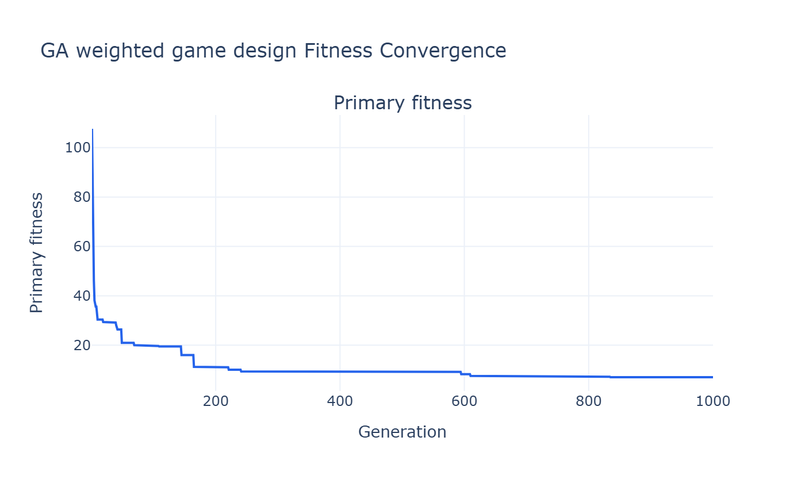 | 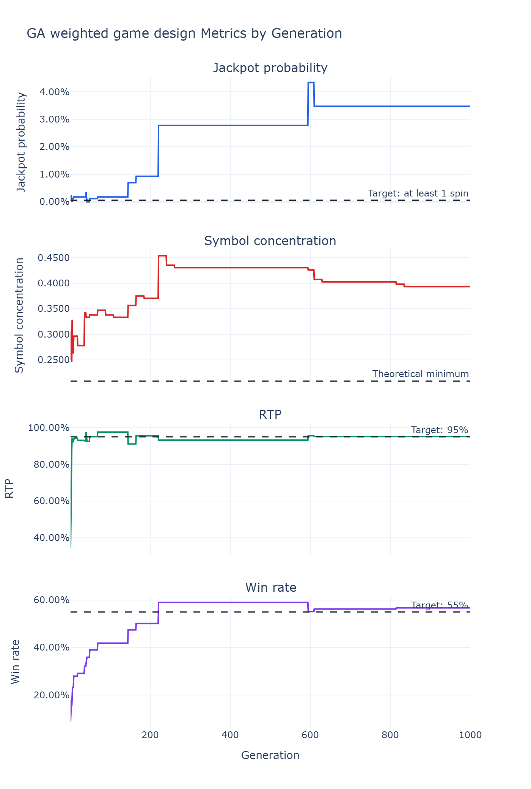 |
| Prize distribution | Reel symbol distribution |
| 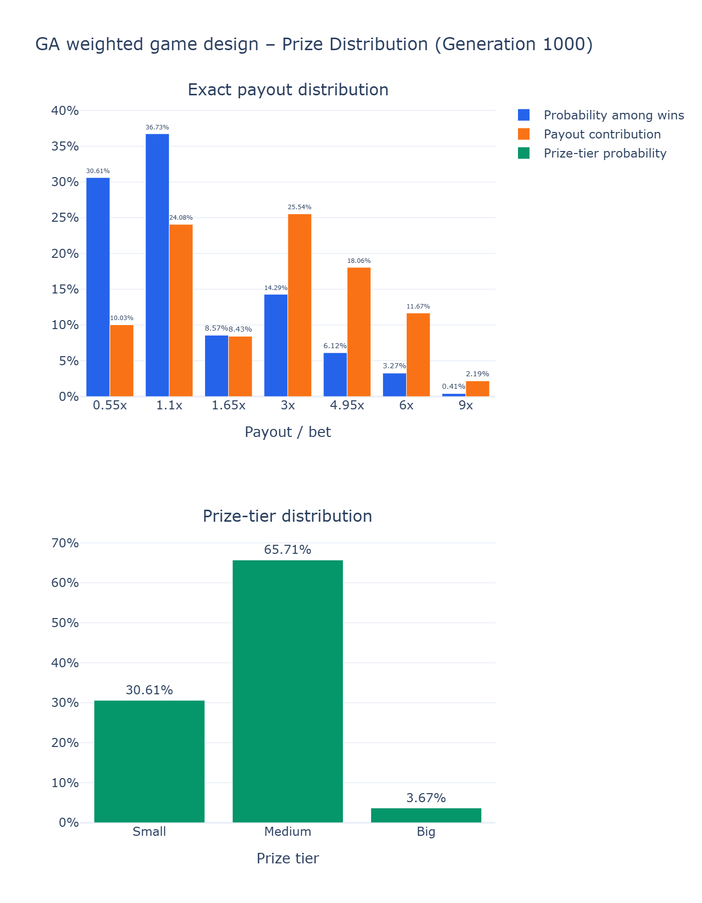 | 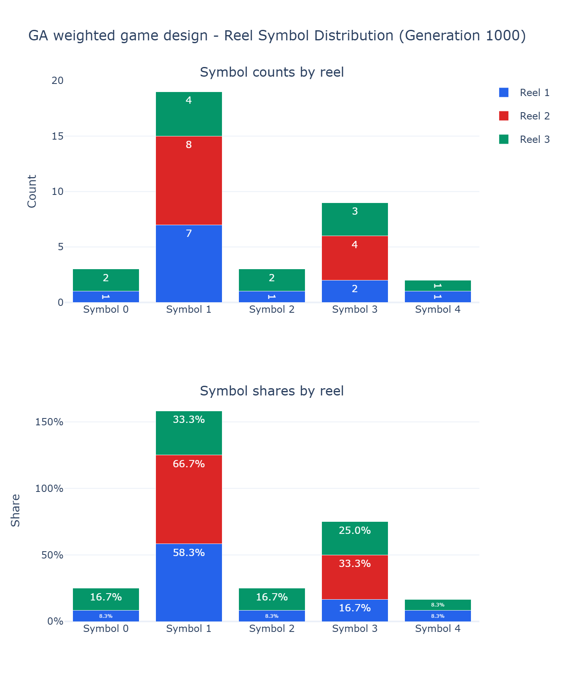 |

</details>

### 4.3 NSGA-II solution 95

Solution 95 has the lowest concentration among the Pareto solutions that pass the
relaxed filter. Its concentration is `0.351852`, which is lower than the Weighted GA.
However, its RTP is only 91.6667% and its win rate is 46.8750%, so it does not satisfy
the original requirements. It is best understood as a trade-off that gives higher
priority to a balanced symbol distribution.

<details>
<summary>Show NSGA-II reels and charts</summary>

```text
Reel 1: [2, 2, 2, 3, 3, 0, 1, 4, 2, 2, 4, 2]
Reel 2: [2, 2, 2, 2, 2, 2, 2, 2, 3, 3, 3, 1]
Reel 3: [0, 2, 2, 2, 2, 4, 3, 3, 1, 1, 4, 0]
```

| Convergence | Metrics |
|---|---|
| 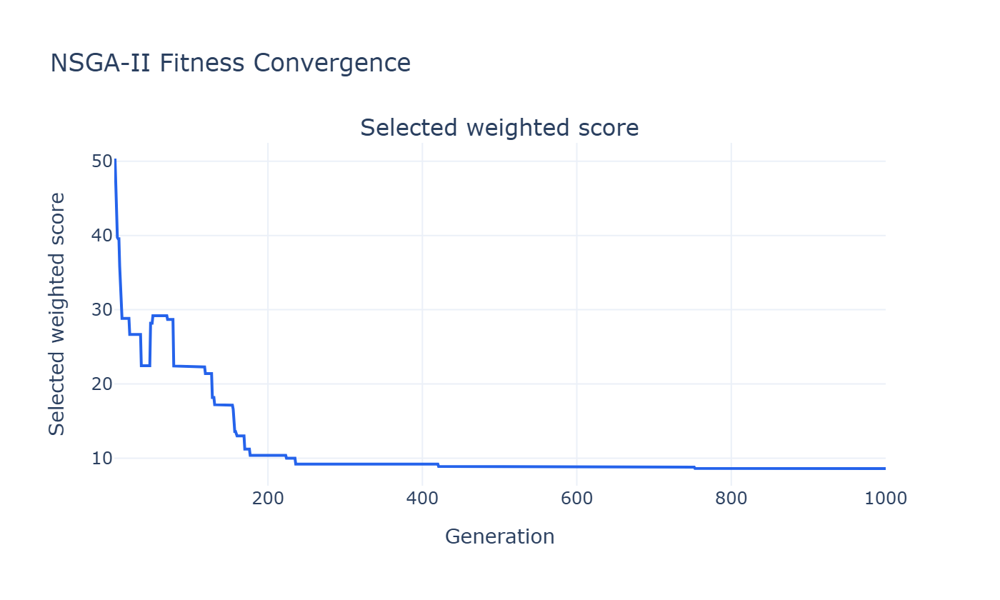 | 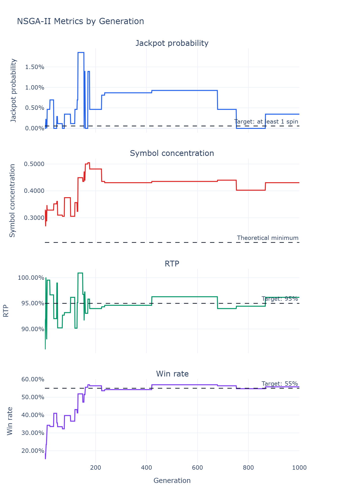 |
| Prize distribution | Reel symbol distribution |
| 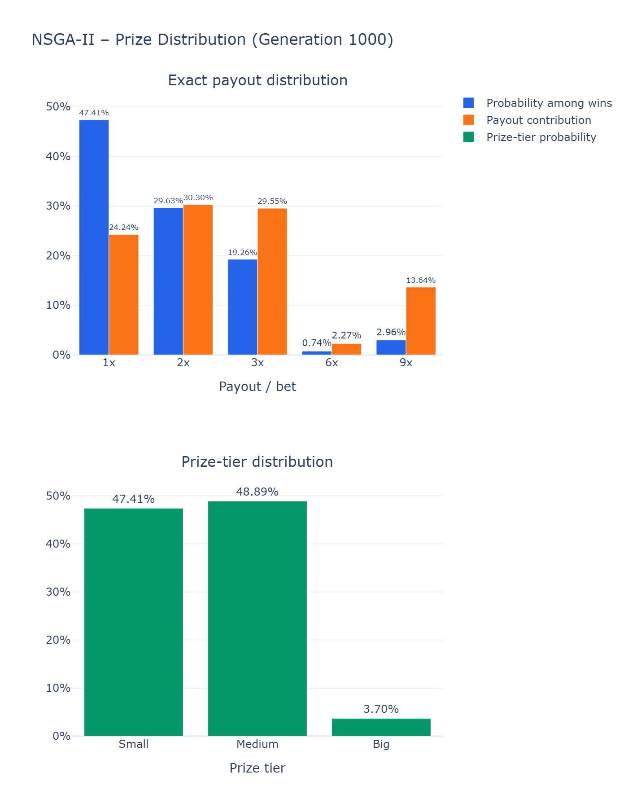 | 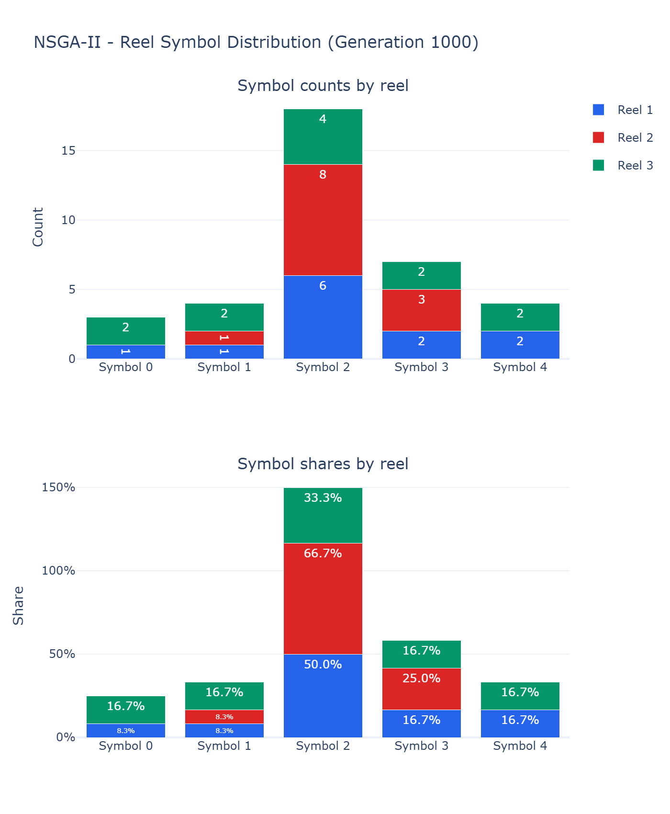 |

</details>

## 5. Takeaway

- The Baseline GA quickly finds a solution that meets the original RTP and win-rate
  requirements, but it does not consider Jackpot availability or reel distribution.
- The Weighted GA meets the main requirements, keeps a possible Jackpot, and improves
  concentration. It is the most practical result from this run.
- NSGA-II provides several alternatives and makes the trade-offs between RTP, win
  rate, Jackpot availability, and concentration easier to see. Solution 95 is useful
  when a lower concentration is more important, but it violates the original RTP and
  win-rate limits.

For this project, I would use the Weighted GA result as the final game design and use
NSGA-II as a tool for exploring alternative trade-offs.

## 6. Possible next steps

This project mainly focuses on reel configuration and game design. There are several
ways it could be extended:

- **Prize distribution and volatility:** RTP alone does not describe how the game
  feels. Small, medium, and big prize frequencies, payout variance, and hit streaks
  could also become optimization objectives.
- **Near-win experience:** The program could measure results that are one symbol away
  from a normal win or Jackpot. This should be handled carefully so that the game does
  not create misleading near-win experiences.
- **Different reel lengths:** All three reels currently have 12 positions to keep full
  enumeration and comparison simple. Allowing different reel lengths would create
  more varied symbol arrangements and probability structures.
- **More game mechanics:** Wilds, Scatters, extra paylines, Free Spins, and Bonus Games
  could be added and included in the optimization.
- **Constraint and solution-selection methods:** I previously tried layered or
  lexicographic ranking for RTP, win rate, Jackpot, and concentration, but it did not
  find a usable solution. Giving the earlier layers too much priority may prevent the
  later objectives from improving and reduce exploration. Adaptive penalties,
  constraint-domination, epsilon constraints, or gradually tightening soft
  constraints could be compared instead. Knee points, distance to an ideal point, or
  reference points could also select a Pareto solution automatically.
- **Parameter sensitivity:** Different penalty weights, mutation rates, population
  sizes, and repair rates should be compared to see how much the results depend on the
  current settings.
- **Result stability:** Genetic Algorithms are stochastic. Repeating each experiment
  with several random seeds would make it possible to report the mean, standard
  deviation, and success rate instead of relying on one run.

## 7. How to run it

Create the environment and install the dependencies:

```powershell
python -m venv .venv
.\.venv\Scripts\python.exe -m pip install -r .\requirements.txt
```

Run the three algorithms:

```powershell
.\.venv\Scripts\python.exe .\GA_baseline.py
.\.venv\Scripts\python.exe .\GA_weighted_game_design.py
.\.venv\Scripts\python.exe .\NSGAII.py
```

The generated results are stored in:

- [Baseline GA results](./ga_baseline_results/)
- [Weighted GA results](./ga_weighted_game_design_results/)
- [NSGA-II results](./nsga2_results/), including the complete
  [Pareto front CSV](./nsga2_results/nsga2_pareto_front.csv)

Each folder contains `best_solution.json`, `ga_history.csv`, and four analysis charts.

Main source files:

```text
slot_game.py                 Game rules and full enumeration
ga_common.py                 Shared metrics, operators, and GA runner
GA_baseline.py               Baseline GA
GA_weighted_game_design.py   Weighted GA
NSGAII.py                    NSGA-II and Pareto front output
ga_plot.py                   Result charts
```
