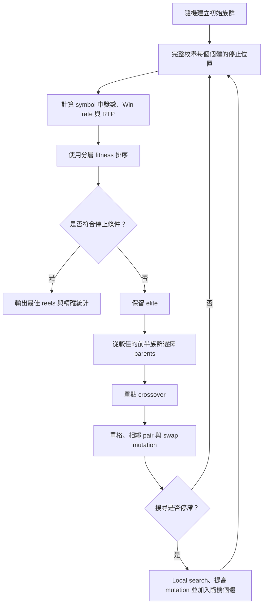

# Slot Game Reel Optimization

這個專案使用 Genetic Algorithm（GA）搜尋符合指定 RTP 與 Win rate 的
3×3 Slot Game reel configuration。

## 作業目標

- RTP（Return to Player）目標為 `95%`。
- Win rate 不得低於 `55%`。
- 遊戲畫面為 3 columns × 3 rows。
- 使用 5 種 symbols：

```python
{
    0: 0.25,
    1: 0.55,
    2: 1,
    3: 3,
    4: 5,
}
```

- 前四種 winning patterns 的獎金為：

```text
Bet amount × symbol multiplier
```

- Pattern 4.5 的獎金為：

```text
Bet amount × symbol multiplier × 5
```

完整題目請參考 [DS-HomeWork.md](./DS-HomeWork.md)。

## 規則假設

目前實作允許同一個畫面同時命中多個 winning patterns，且每個命中的
pattern 都會獨立計算獎金。

因此，如果整個 3×3 畫面都是相同 symbol，會同時命中 patterns
4.1、4.2、4.3、4.4 與 4.5，最終獎金為所有 pattern 獎金的總和。

## 精確統計方式

`slot_game.py` 會枚舉三個 reels 的所有停止位置，而不是使用隨機模擬
估算最終結果。

如果三個 reels 的長度分別為 `L1`、`L2`、`L3`，總組合數為：

```text
L1 × L2 × L3
```

每個組合都會計算：

- 是否中獎。
- 命中的 winning patterns。
- 總獎金。
- 整體 RTP。
- 整體 Win rate。
- 各 symbol 的中獎局數、中獎率、命中 pattern 數與總獎金。

## Genetic Algorithm

執行 [GA.py](./GA.py) 會搜尋 reel configuration。

目前設定為：

```python
REEL_LENGTH = 12
POPULATION_SIZE = 200
GENERATIONS = 500
TARGET_RTP = 0.95
MIN_WIN_RATE = 0.55
```

雖然題目允許三個 reels 使用不同長度，目前先固定為相同的 12 格，以
控制搜尋空間並簡化 crossover。

### 額外限制

除了原始題目的 RTP 與 Win rate 要求，目前 GA 額外要求五種 symbols
都必須至少產生一個中獎組合。

這項限制不是原始題目的明確要求，而是為了避免某個 symbol 雖然存在於
reels 中，實際上卻永遠無法中獎。

### 分層 Fitness

GA 使用 lexicographic（分層）排序：

```python
fitness_score = (
    missing_winning_symbol_count,
    win_rate_shortfall,
    rtp_error,
)
```

比較順序為：

1. 優先減少無法中獎的 symbol 數量。
2. 所有 symbols 都能中獎後，讓 Win rate 達到 `55%`。
3. Win rate 達標後，讓 RTP 接近 `95%`。

這種設計可避免不同限制透過人為 penalty 權重互相抵銷。

### GA 簡易流程



每一代的處理步驟如下：

1. 對 population 中的每組 reels 完整枚舉所有停止位置。
2. 計算各 symbol 中獎局數、整體 Win rate 與 RTP。
3. 依照分層 fitness 排序個體。
4. 保留前 `ELITE_SIZE` 個最佳個體。
5. 從排名較佳的前半族群選擇 parents，使用單點 crossover 產生
   children。
6. 對 children 執行三種 mutation：
   - 單格 replacement：改變單一位置的 symbol。
   - 相鄰 pair replacement：將相鄰兩格改為相同 symbol，協助形成
     2×2 winning pattern。
   - Swap mutation：交換兩個位置，改變排列但保留 symbol 數量。
7. 如果連續 `STAGNATION_LIMIT` 代沒有改善，執行 local search、提高
   mutation rates，並加入隨機個體增加多樣性。
8. 建立下一代並重複上述流程。

GA 會在以下條件同時成立時提前停止：

```python
missing_winning_symbol_count == 0
win_rate >= MIN_WIN_RATE
abs(rtp - TARGET_RTP) < 0.0001
```

## 執行環境

專案只使用 Python 標準函式庫，不需要安裝第三方套件。

可以直接使用專案的 virtual environment 執行：

```powershell
.\.venv\Scripts\python.exe .\slot_game.py
```

執行 GA：

```powershell
.\.venv\Scripts\python.exe .\GA.py
```

如果 PowerShell 允許執行啟用指令碼，也可以先啟用環境：

```powershell
.\.venv\Scripts\Activate.ps1
```

如果系統禁止執行 `Activate.ps1`，不需要修改系統設定，直接使用
`.venv\Scripts\python.exe` 即可。

## 檔案說明

```text
DS-HomeWork.md  原始作業要求
slot_game.py    Slot Game 規則、付款與精確統計
GA.py           Genetic Algorithm reel 搜尋
README.md       專案設計與執行說明
```

## 最終結果

GA 搜尋完成後，應將最終 reels 與完整枚舉的驗證結果記錄於此：

```text
Reel 1: 尚待產生
Reel 2: 尚待產生
Reel 3: 尚待產生

Exact RTP: 尚待驗證
Exact Win rate: 尚待驗證
All symbols can win: 尚待驗證
```
